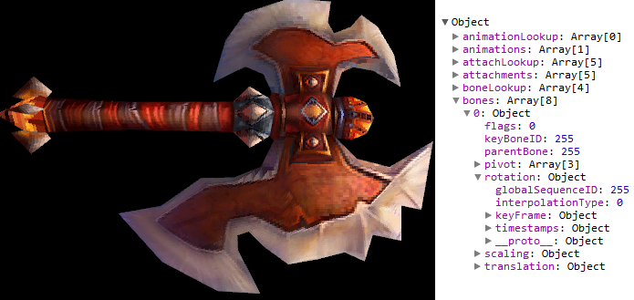

jsWoWModelViewer
================

Display World of Warcraft Models (M2) in browser.

It uses [jBinary](https://github.com/jDataView/jBinary) library for loading & parsing binary data and WebGL for rendering.

Demo: http://vjeux.github.io/jsWoWModelViewer/

